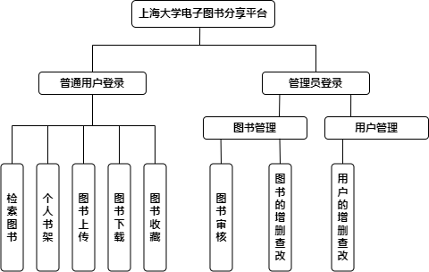
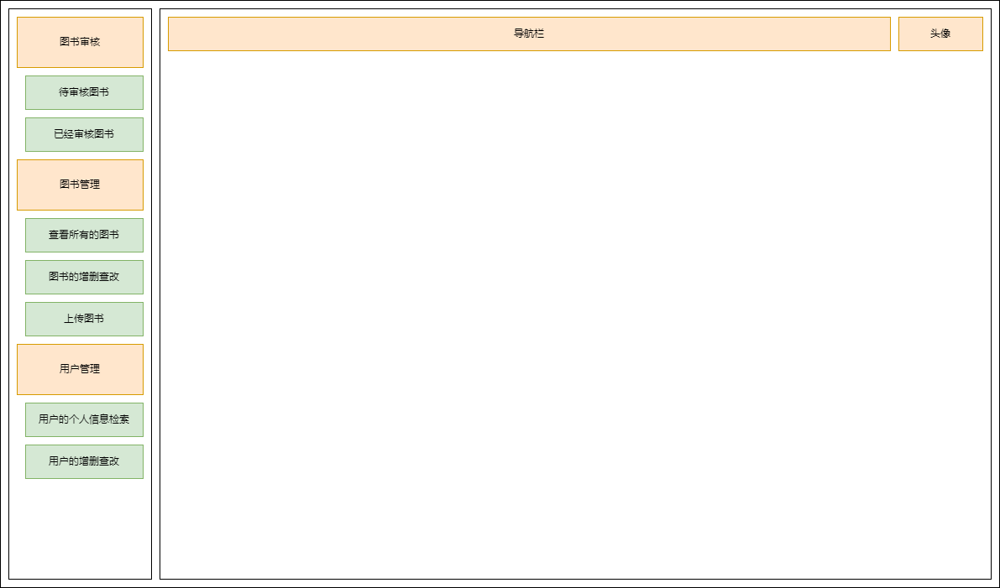

# 上海大学电子图书分享平台

# 1. 项目背景

随着数字化和互联网的发展，电子书的出现让读者可以更加方便地获取和阅读自己所需的图书。在大学内部，学生们需要大量的学习资料和教材，而电子图书可以提供更加便捷的获取方式，并且可以节约大量纸张和空间资源。

然而，目前大学内部的电子图书分享平台存在着一些问题，如书籍数量有限、搜索不方便、下载速度慢、平台使用复杂等，我们上海大学更是没有相关的平台存在，这就更给在校大学生获取知识造成障碍。

因此，我们需要开发一个更加高效、方便、实用的电子图书分享平台，以满足学生们在学习过程中的需要。

# 2. 项目目的

我们打算开发一个旨在为大学内部的学生提供一个集***图书分享***、***借阅***、***下载***于一体的服务平台，主要目标包括：

- 为在校大学生提供丰富的电子书资源，***尽可能的涵盖学校内所有的专业，所有的年级***，以满足学生的不同需求；
- 由于我们开发者搜寻图书资源的能力肯定是有限的，所以说我们提供了***用户上传图书接口***，供学生上传自己的电子资源，并且通过后台的相关人员进行审核之后完成上架；
- 用户登录首页我们提供***搜索功能***，可以实现快速的定位到所需要的电子书籍；
- 我们还***提供书架***的功能，存放学生所添加到书架的书籍；
- 我们提供***快速、稳定的下载速度***，使得学生可以迅速的获取所需要的电子书资源；

通过以上目标的实现，我们的电子图书分享平台将成为大学内部学生学习生活的必备工具，为学生提供更加便捷、高效的学习服务。

# 3. 项目框架

## 3.1 前端

前端主要使用`Vue + Element UI` 相关技术进行开发。

## 3.2 后端

后端主要使用`Spring Boot` 、 `Mybatis-Plus`、`Maven`等技术进行实现。

# 4. 主要功能模块

## 4.1 后端管理

## 4.2 前台设计

