> 如果你想在本地测试该项目或者部署在云服务器上测试该项目的话，可以参考本指导文档。

# 1. 本地环境部署

## 1.1 创建本地相关的文件夹并修改yml文件

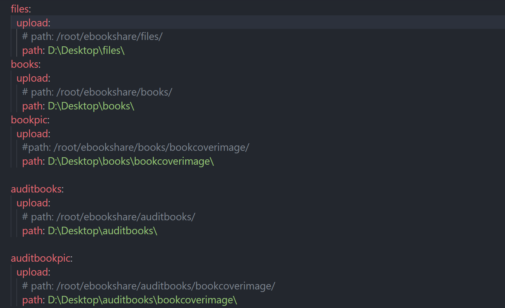

我们需要修改Spring Boot的配置文件：`application.yml`文件，如果你想要在本地进行测试的话，请将上面每一个参数的第二个值进行修改，修改为相应的你本地创建的文件夹的路径。

## 1.2 配置数据库

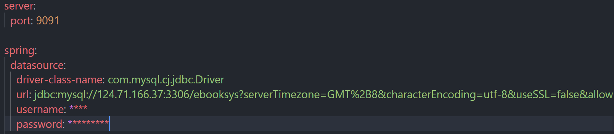

同样在`application.yml`文件中进行配置，修改相应的IP以及用户名称或者用户密码即可，最上面的是配置后端的运行端口。

***这样的话后端项目就可以直接在本地运行起来，接下来去修改相应的前端相应的代码即可完成交互：***

## 1.3 修改前台代码

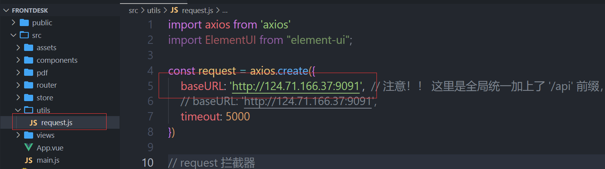

我们找到`request.js`文件，修改相应的端口即可，如果你发现修改此处之后可能部分的接口还是有问题，那么需要你去相应的文件去修改接口：


有的接口是这样写的，这是因为我们需要在云端和本地来回测试，有的可能需要同时使用到云端的接口和本地的接口，云端的数据进行渲染，本地的接口进行测试，所以这里导致了代码的不规整。

修改之后，在前台的文件夹打开终端输入以下命令：

```shell
npm install

npm run dev
```

***这样即可在本地运行前台项目。***

## 1.4 修改后台代码

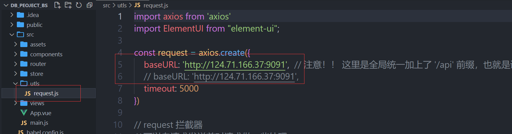

同样的，我们需要在`request.js`文件中修改相应的接口。

修改之后在命令行中输入：

```shell
npm install

npm run serve
```

即可在本地运行我们的后台项目。

# 2.云端环境部署

## 2.1 打包后端项目

如果你想在云端进行部署的话，你最好是现在本地进行部署进行测试，测试完成之后，你需要将相关的数据库的连接地址修改为相应的云服务器上的地址：

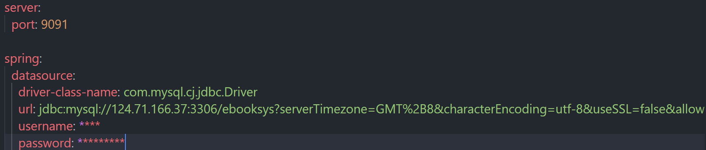

需要将那些配置的文件夹目录修改为相应的在云服务器上的文件夹的地址：

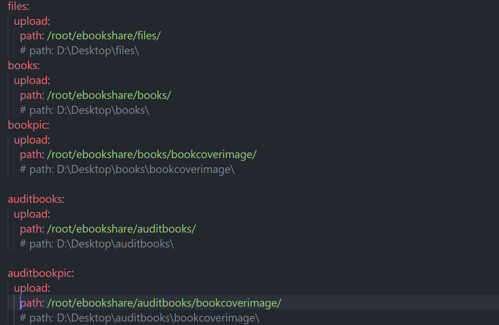

这样之后，在后端的项目文件夹打开终端：

```shell
mvn clean package
```

进行打包操作，打包成功之后，会显示：

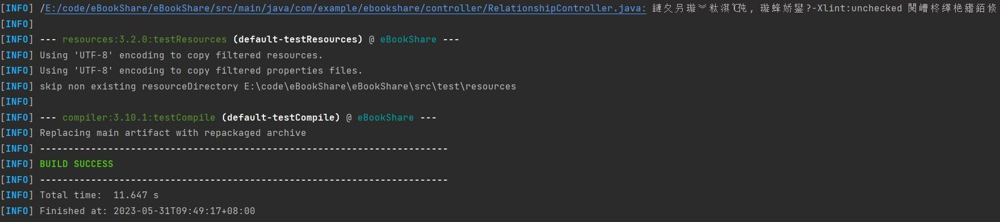

打包结束之后，我们就可以在`eBookShare/target/eBookShare-0.0.1-SNAPSHOT.jar`路径去找到我们打包好的`jar`包文件。

或者由于我们在测试的时候不想频繁输入的话，你可以在`IntelliJ IDEA`中下载相关的插件：


下载完之后，你会在项目的选项中发现多出一个选项：

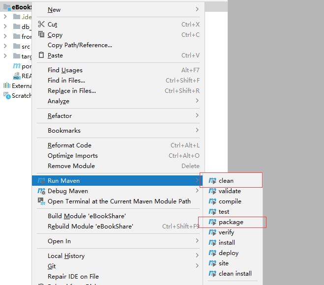

## 2.2 将后端项目利用docker运行在云服务器

确保你的云服务器上面安装有docker，然后相关的环境为下图所示：

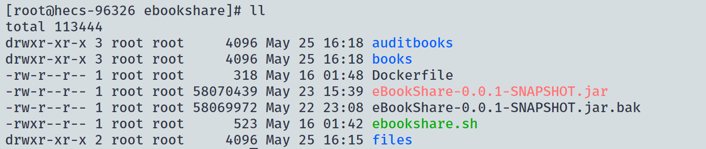

将圈起来的文件放在同一级目录下面，然后运行`ebookshare.sh`脚本就会完成我们项目的部署，`Dockerfile`文件的内容：

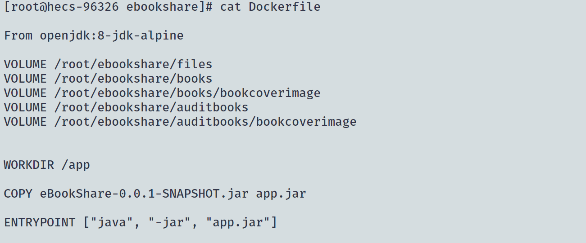

就是我们在有java环境的镜像的基础之上，进行文件夹的映射，指定相应的工作目录等等。

`ebookshare.sh`文件内容：

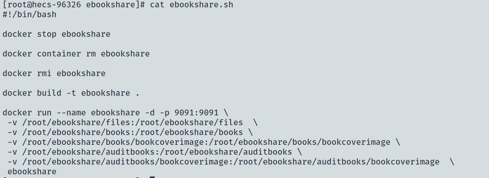

就是先停止相关的运行的容器，然后重新根据jar包文件进行构建镜像，然后创建容器，并完成相关的文件映射即可。

## 2.3 打包前端项目

首先在前端的项目中运行：

```shell
npm run build
```

我们会发现前端项目的文件夹会多出一个名为`dist`的文件夹。

我们将该文件夹上传到服务器上：

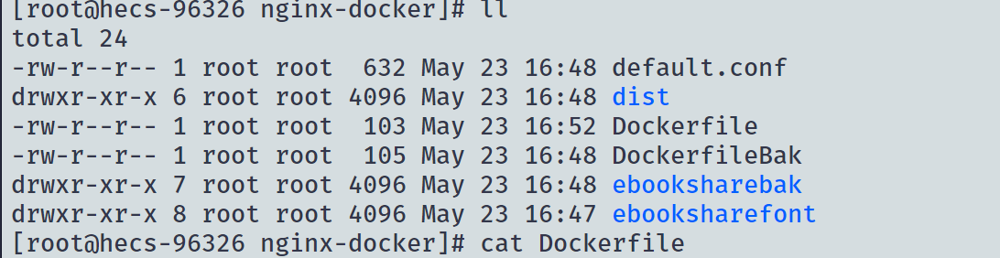

其中`default.conf`文件是配置nginx的配置文件，我们需要对其进行修改：


将相应的IP进行替换即可。

`Dockerfile`文件是构建我们的镜像，`ebooksharebak`里面的内容就是我们的后台项目当中`dist`文件中的相应内容, `ebooksharefont`里面的内容就是我们前台项目中`dist`文件中的相应内容。

如果你要部署前台项目的话，你需要将`Dockerfile`文件中相关名字进行修改：


修改之后：

```shell
# 构建镜像
docker build -t ebooksharefont .
# 构建容器，并映射到主机的8081端口，即我们可以如果8081端口访问到我们的项目
docker run --name ebooksharefont -d -p 8081:80 ebooksharefont:latest
```

